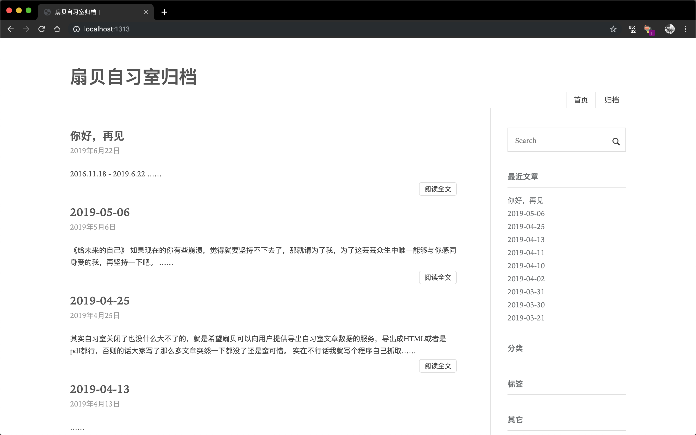
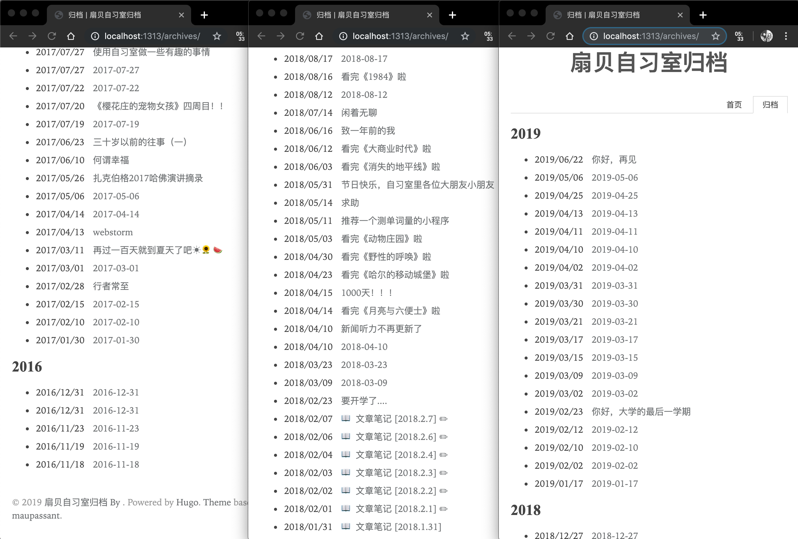
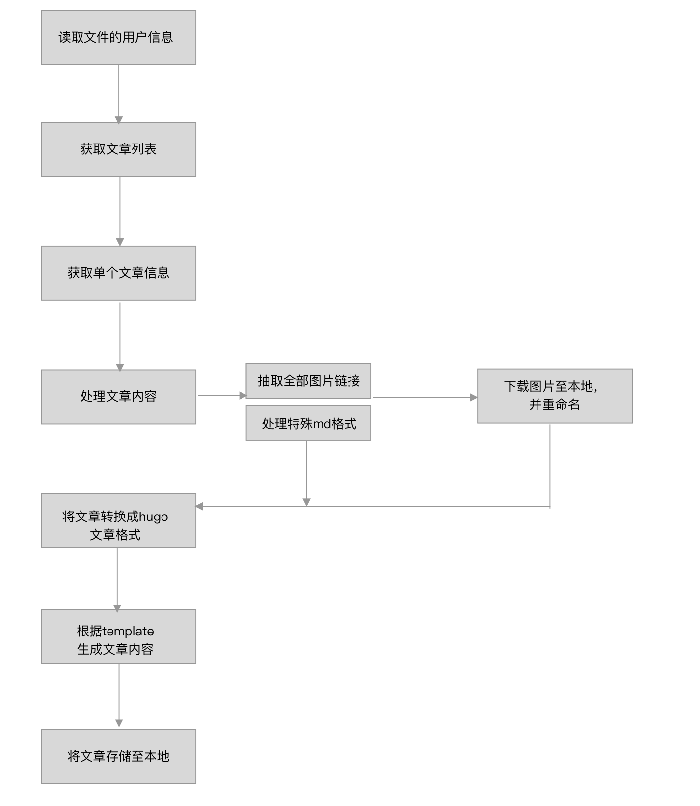
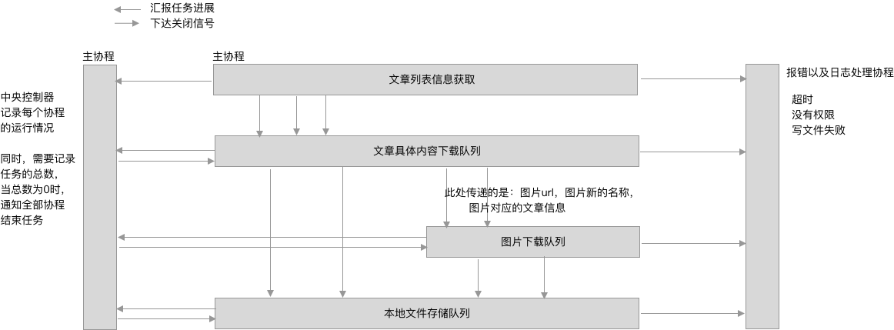
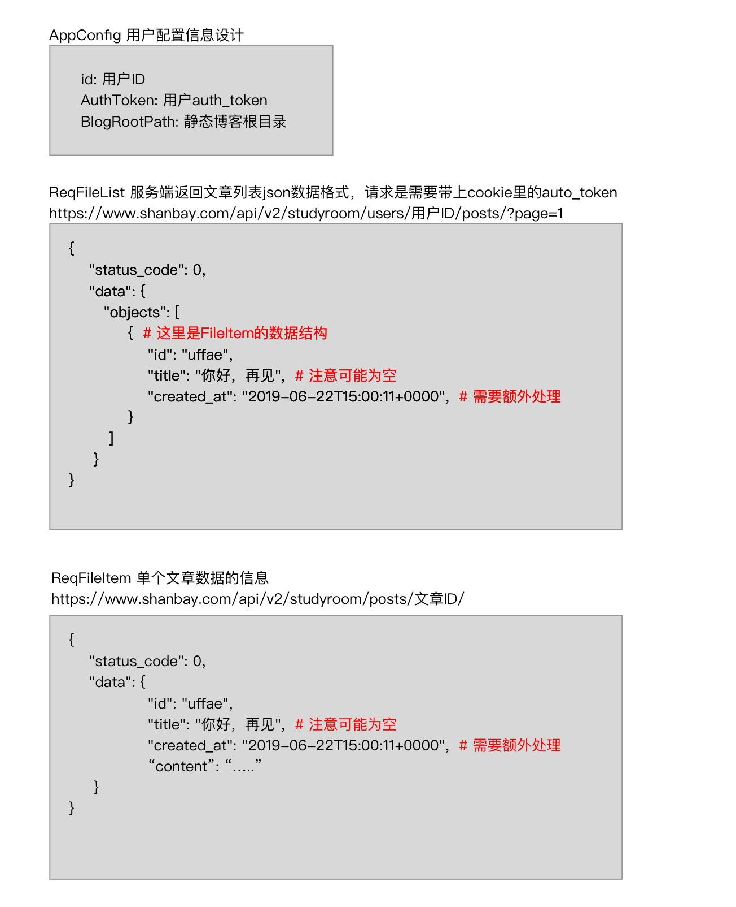
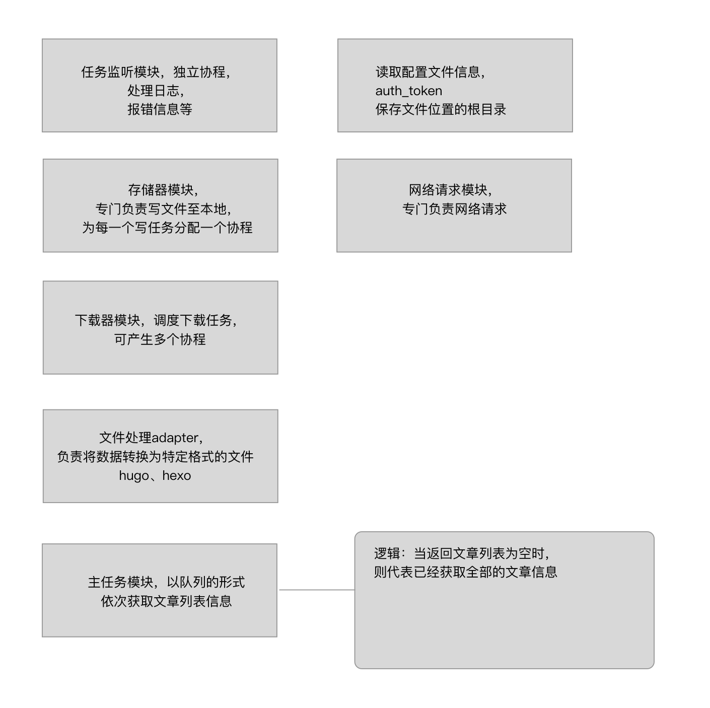
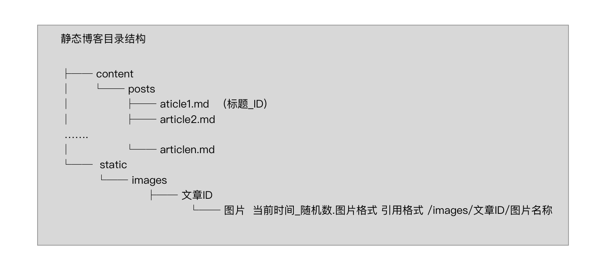

# Save My Shanbay Post

扇贝自习室已经于2019.6.30从app上全面下线，在它运营的2年多时间里，我在上面写了快200多篇帖子，怎么能就让它们这么白白消失了呢？

幸好我手机上的扇贝单词还没有升级成最新的，所以依然可以访问到。抓了它的api接口之后我把我所有的文章外加里面的图片全部抓了下来制作成了静态博客永久保存起来。

有的时候，回忆必须要有能力去捍卫。

---

将扇贝自习室的文章制作成[hugo](https://gohugo.io/)形式的博文

先使用hugo生成项目骨架，然后将启动程序，自动将文本内容保存至 `/content/posts下`，图片保存至 `/static/images`下

需要事先填写配置文件 config.json，`auth_token`为登录扇贝网后它的cookie中的内容,`auth_token=eyJ0eXAiOiJKV1QiLCJhbG...`，`user_id`可以在扇贝App的个人页面上看到"扇贝ID"，`blog_path_root` 为hugo博客的根路径，最后不要加`/`

---

## 业务逻辑设计

---

## 消息传递设计

其中最右边的模块目前未实现，最左边的模块也只是简答的`WaitGroup`

---

## 部分外部接口清单

---

## 模块设计

部分模块未实现，或者功能有出入

---

## 静态博客的部分目录

